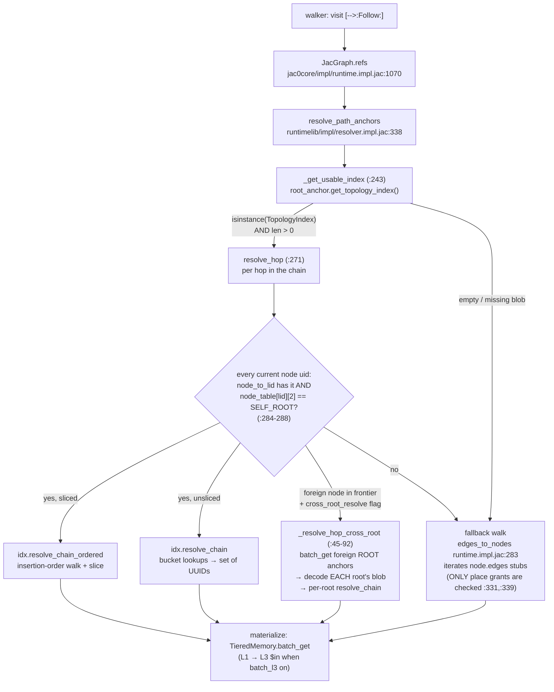
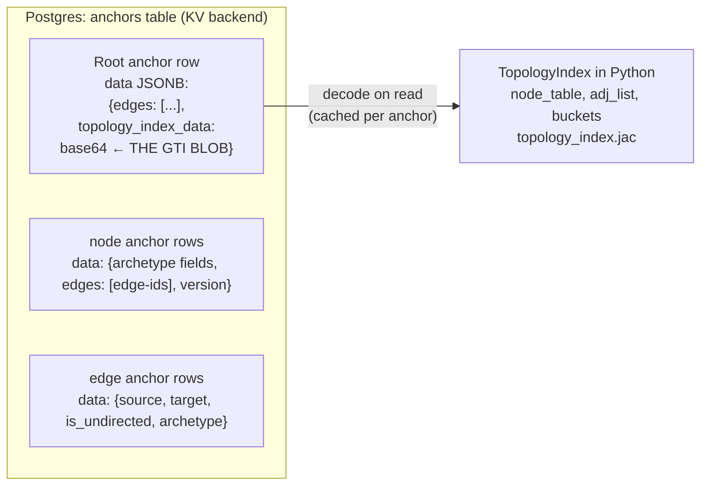
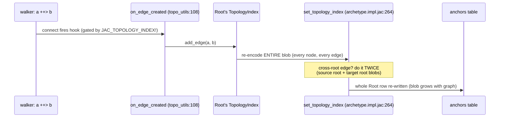
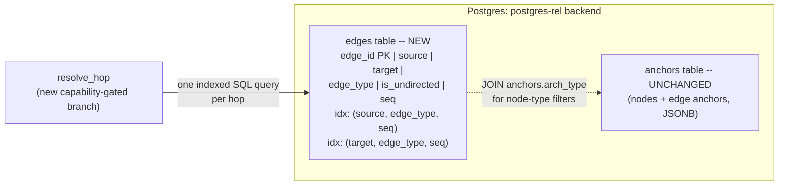
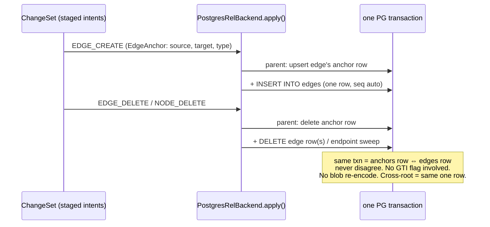
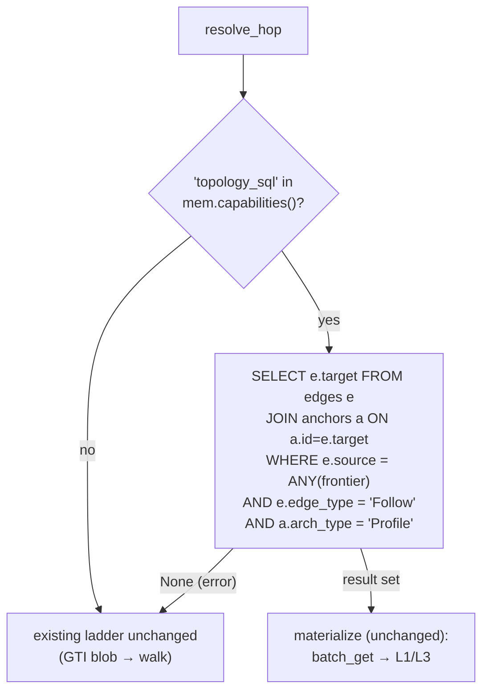

# Architecture: GTI-as-blob (today) vs GTI-as-table (this branch)

Learning companion for `feat/pg-rel-mvp`. Everything here is scout-verified against this
worktree (`5fbce338e`); file:line refs are clickable in your editor.

## 1. The system today: how a walker hop actually resolves

When a walker does `visit [-->:Follow:]`, this is the full path:

Key asymmetries to remember:

- **Grants fire only on the fallback walk.** The indexed path never checks `check_read_access`.
  Our SQL path inherits the same semantics -- fair vs GTI.
- **Cross-root is expensive by construction**: each foreign root costs a root-anchor fetch +
  a full blob decode, because each root owns its own private index.

## 2. Where the GTI lives: a blob inside the Root anchor's row

Blob wire format v2 (`topology_index.impl.jac:437-467`): header `<BHHi>` (version, num_types u16,
num_nodes u16, num_edges i32), then type table (names + MRO chains), node table
(16B uuid + type_id + 16B owner_root uuid), edge list (`src_lid, etid, tgt_lid` as u16 triples).
**u16 = hard 65,535-nodes-per-root ceiling, silent corruption past it.**

### The write-amplification problem (what this branch kills)

One follow edge on a 15k-anchor graph = re-serialize the whole index. Concurrent connects to
the same root = blob-level last-writer-wins (no CAS on `topology_index_data`) -- the known
concurrent-edge-discard race.

## 3. This branch: the edges table replaces the blob

Write path -- edge maintenance moves INTO the L3 transaction, out of runtime hooks:

Read path after (compare with diagram 1's cross-root spaghetti):

Cross-root: **the concept disappears.** The edges table is global; a hop's frontier can span
any number of roots and it's still one query. No foreign-root fetches, no per-root decode,
no `cross_root_resolve` flag needed on this path.

## 4. What stays identical (inheritance map)

`PostgresRelBackend(PostgresBackend)` -- everything not listed above is inherited:

| Inherited untouched | Where |
|---|---|
| Pool process-cache (per dsn, lock, atexit) | postgres.impl.jac:82-118 |
| Autocommit-toggle read pattern (5fbce338e) | :751-761 etc. |
| `_pg_merge_write`: OCC via cas_version, FOR UPDATE row lock, edge-list merge, empty-node auto-delete | :376-565 |
| Quarantine machinery + INERROR guard | :175-227, :1056-1077 |
| fsck / recover / aliases | various |
| 40-test conformance surface | test_postgres_backend.jac |

## 5. The ablation story this enables

| Config | Topology answered by | Measures |
|---|---|---|
| `postgres` (KV) + GTI on | blob decode in Python | today's baseline (124.8ms feed p50) |
| `postgres-rel` + `JAC_TOPOLOGY_SQL=0` + GTI on | blob (rel storage inert) | storage-swap-only delta ≈ 0 (control) |
| `postgres-rel` + SQL hops + GTI on | edges table | hop-resolution delta, blobs still maintained |
| `postgres-rel` + SQL hops + **GTI off** | edges table | + write-amplification savings (blob re-encode gone) |

## 6. Honest limits (ledgered in the spec)

- SQL hop = 1 round-trip per hop (~0.3-1ms) vs in-memory dict lookups on a warm decode cache.
  Wins come from writes, cross-root, cold paths, scale -- not from beating a hot cached blob.
- Node-type filters are exact-match in MVP (GTI fans out over MRO; superclass filters diverge).
  Edge-type exact-match is parity (GTI is exact-match there too).
- `[edge -->]`-style edge-object collection bypasses the resolver's final hop -- not accelerated.
- Serializer/hydration tail (~25%/17% of profile) untouched by design.
